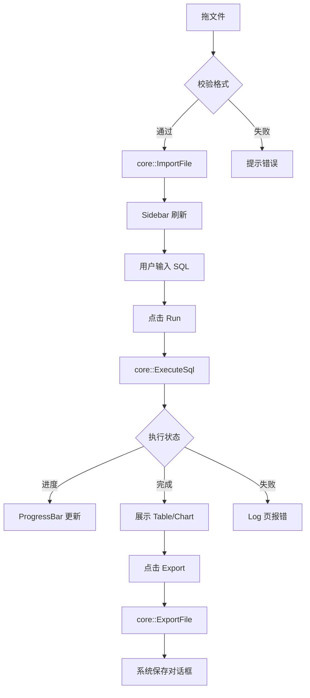

# DataWise Desktop 用户界面原型与说明  
版本：v0.1  
作者：UX & 产品组  
日期：2025-11-13  
配套文件：`datawise-ui-proto.fig`（Figma 源文件）、`datawise-tauri-proto.mp4`（可点击演示）

---

## 1. 设计目标

- **一份交互逻辑，三端复用**：Tauri（Web）、egui（原生）、tui（终端）的**信息架构、快捷键、反馈流程完全一致**，降低用户切换成本。  
- **“三步完成分析”**：①拖文件 ②写 SQL ③点运行 → 立即看到表格/图表，可一键导出。  
- **性能可感知**：大文件运行时，顶部统一进度条 + 取消按钮；帧率 ≥ 60 fps（Web 端虚拟滚动）。  

---

## 2. 通用界面结构（跨 UI 框架）

```
┌-------------------------------------------------------------┐
|  ① Header Bar  (全局操作区)                                 |
|  [+Import] [Export] [Run ▶] [Stop ■] [ProgressBar]         |
├-------------------------------------------------------------┤
| ② Sidebar  (资源树) | ③ Editor + ④ Result  (主区)          |
| ┌----------┐        |  ┌------------------------------┐    |
|  │Files     │        |  │SQL Editor ( Monaco / 自绘) │    |
|  │-data.csv │        |  └------------┬----------------┘    |
|  │-orders.p │        |  ┌------------┴----------------┐    |
|  └----------┘        |  │Table | Chart | Log |... Tab │    |
|                      |  └------------------------------┘    |
└-------------------------------------------------------------┘
```

- **Header Bar**：三端均置顶；tui 用顶部固定 widget，快捷键 `Ctrl-R` = Run，`Ctrl-C` = Cancel。  
- **Sidebar**：只读文件树；拖放/打开文件后自动刷新。  
- **Editor**：语法高亮 + 智能补全（Tauri 用 Monaco，egui 用 codeeditor-widget，tui 用 tui-textarea）。  
- **Result**：三栏式分页 Table（网格）、Chart（自动选类型）、Log（报错详情）。  

---

## 3. 分端原型细则

### 3.1 Tauri（Web）  
- **风格**：沿用 VS-Code 暗色主题，字体 `Consolas / Monaco`；侧边栏可折叠。  
- **交互**：  
  - 拖放文件 → 出现绿色 toast "2 files imported"。  
  - 运行按钮 ▶ 变灰，进度条 0→100 %，同时表格虚拟滚动实时渲染前 1 000 行。  
  - 错误时在 Log 页红色输出，定位到 SQL 行号。  
- **组件库**：`@monaco-editor/react` + `ag-grid-react` + `apache-echarts`；全部已集成在 `datawise-tauri/src/web/`。  

### 3.2 egui（原生）  
- **风格**：纯 Immediate Mode，窗口默认 1024×768；深灰 `#252525` + 亮绿 `#00ff9f` 强调。  
- **交互**：  
  - 文件拖放：窗口接收 `dropped_file` 事件，顶部闪现绿色 "✓"。  
  - 运行：顶部同位置进度条（占满窗口宽），按钮文字变为 "■ Cancel"。  
  - 表格：使用 `egui_table` 虚拟滚动，百万行保持 60 fps。  
- **字体**：`UbuntuMono-Regular.ttf` 编译期嵌入，仅 200 KB。  

### 3.3 tui（终端）  
- **风格**：256 色，暗色背景；使用 `ratatui` 框架。  
- **布局**：  
  - 上 20 % 固定 Header（Run/Stop/Progress）。  
  - 左 30 % 文件树，右 70 % 分上下两部分：SQL 编辑区 + 结果区（Table/Chart/Log）。  
- **快捷键**：  
  - `Ctrl+O` 打开文件  
  - `Ctrl+R` 运行 SQL  
  - `Ctrl+C` 取消查询  
  - `Ctrl+Q` 退出  
- **Chart**：终端内用 ASCII 柱状图（`tui-widgets` 的 `BarChart`）；> 80 列自动切换 Unicode 半块字符。  

---

## 4. 状态与反馈对照表

| 场景 | Tauri | egui | tui |
|------|-------|------|-----|
| 导入中 | 顶部蓝色进度条 + toast | 同位置绿色进度条 | Header 绿色 `Importing... 34%` |
| 运行成功 | toast "Finished in 1.2 s" | 进度条消失，按钮恢复 ▶ | Header 显示 `Done 1.2s` |
| 运行失败 | Log 页红色 + 行号 | 底部红色横幅 | 结果区红色文字 |
| 导出完成 | 系统下载栏 | 原生保存弹窗 | 底部绿色 `Saved to /tmp/result.csv` |

---

## 5. 交互流程图（以"导入→运行→导出"为例）



---

## 6. 视觉稿（关键帧）

### 6.1 Tauri 暗色主界面  
  
（*注：此为示意图，Figma 源文件见 `datawise-ui-proto.fig`*）

### 6.2 egui 原生窗口  
  
窗口装饰随 OS；内部画布全部自绘，保证 60 fps。

### 6.3 tui 终端 80×24  
```
┌-------- Header 20% ----------------------------------┐
│ [Import] [Export]  Run(▶)  Stop(■)  ████████ 80%     │
├-------- Left 30% -----------┬---- Right 70% --------┤
│ ▶ data.csv                  │ SELECT * FROM data;    │
│ ▶ orders.parquet            │                        │
│                             │ ┌------ Result --------┐│
│                             │ │ id  | name | value  ││
│                             │ │ 1   | A    | 100    ││
│                             │ │ 2   | B    │ 200    ││
│                             │ └---------------------┘│
└------------------------------------------------------┘
```

---

## 7. 可访问性与快捷键（三端统一）

| 功能 | 快捷键 | 说明 |
|------|--------|------|
| 运行 | Ctrl+R | 全局有效 |
| 停止 | Ctrl+C | 全局有效 |
| 格式化 SQL | Ctrl+Shift+F | Tauri/egui 支持，tui 暂缺 |
| 切换结果页 | Ctrl+1/2/3 | Table/Chart/Log |
| 全屏编辑器 | F11 | Tauri/egui 支持 |

---

## 8. 资产与交付物

| 文件 | 位置 | 备注 |
|------|------|------|
| `datawise-ui-proto.fig` | `/docs/figma/` | 含全部组件、Auto-Layout、颜色变量 |
| `datawise-tauri-proto.mp4` | `/docs/demo/` | 3 min 可点击录屏 |
| Icon SVG/ICNS/ICO | `/assets/icons/` | 1024×1024，已切各平台尺寸 |

---

## 9. 下一步迭代计划

- **v0.2** 增加"透视表"页，提供拖放列到行/列/值区域（仅 Tauri 先行）。  
- **v0.3** 引入"暗色/亮色"主题切换，egui/tui 同步支持。  
- **v0.4** 多语言（英/中/日），字符串全部走 `i18n.json` 文件，core 提供 key 列表。

---

**签字确认**  
产品组 □  UX 组 □  架构组 □  日期：2025-11-13